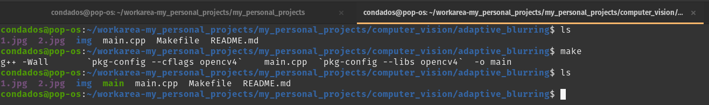
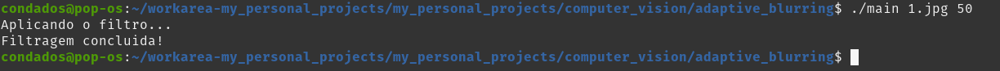
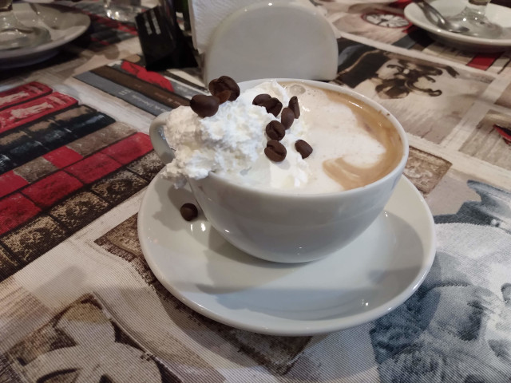
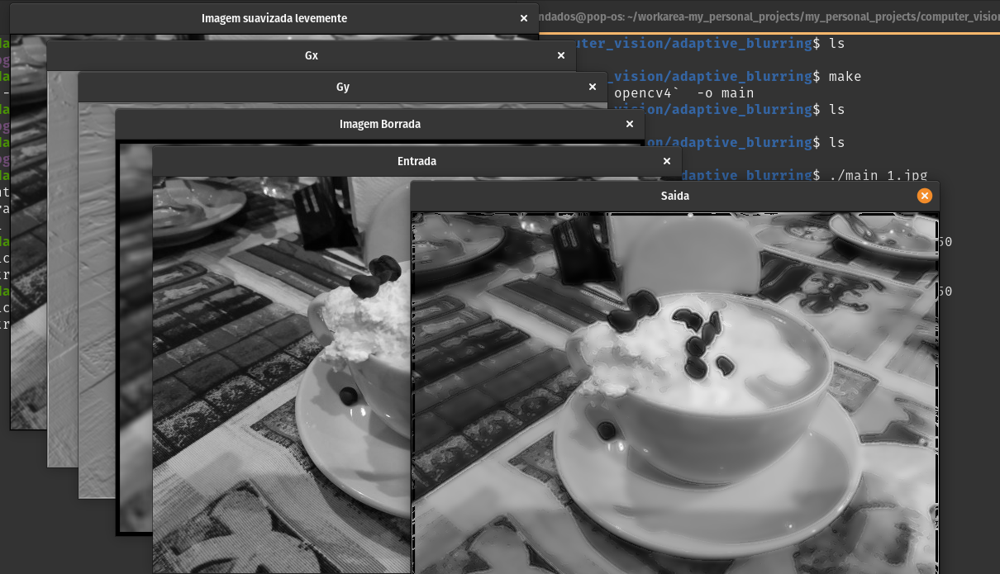
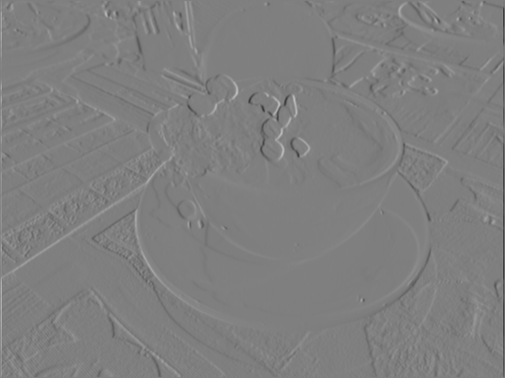
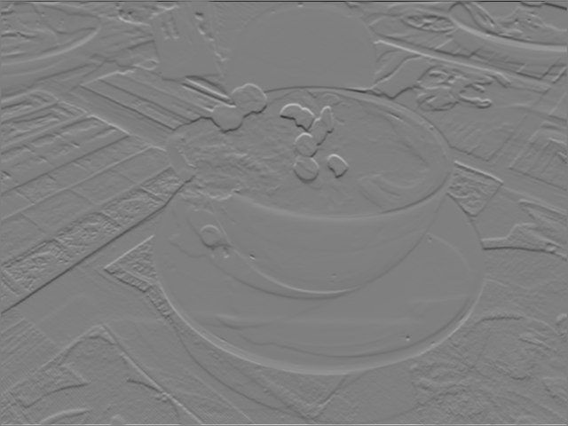
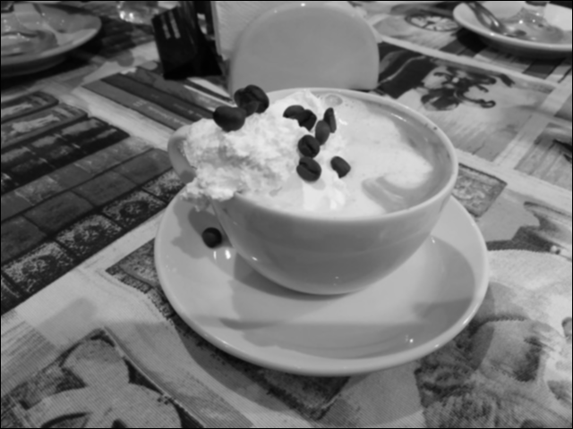
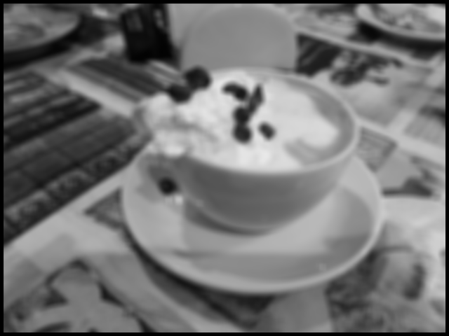
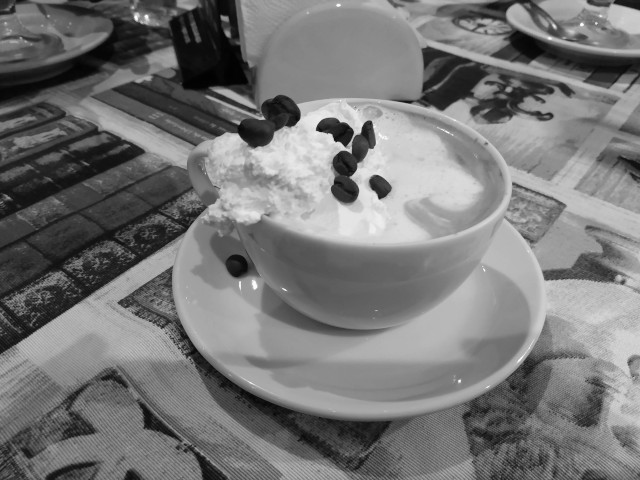
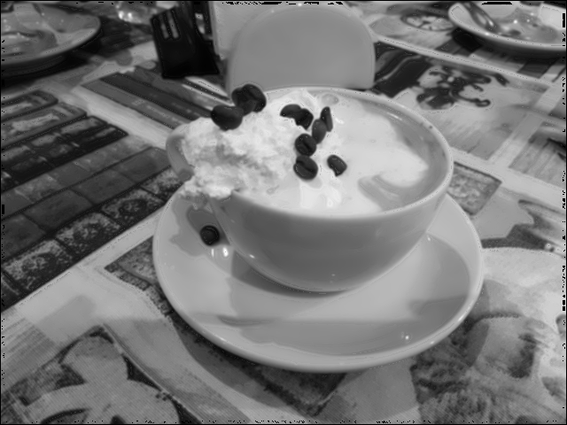

# Filtro de Borramento Adaptativo

## Pré-requisitos:
- OpenCV na versão 4x\
    Recomendo baixar da fonte: [Github OpenCV](https://github.com/opencv/opencv)

## Compilando e Executando o programa

> Não explicarei aqui como instalar e preparar o ambiente necessário, sinta-se a vontade para fazer 
> isso como achar melhor.

Usando o **make** basta fazer:

```
$ make
```
e o programa estará compilado se tudo estiver funcionando :P.



## Executando

Para executar basta fazer:

```
./main input_image threshold
```



Utilizei essa imagem como entrada:



E um threshold de 50.

O programa gerou algumas imagens de saída que ajudam a visualizar as etapas realizadas pelo programa.



Saídas do programa:






