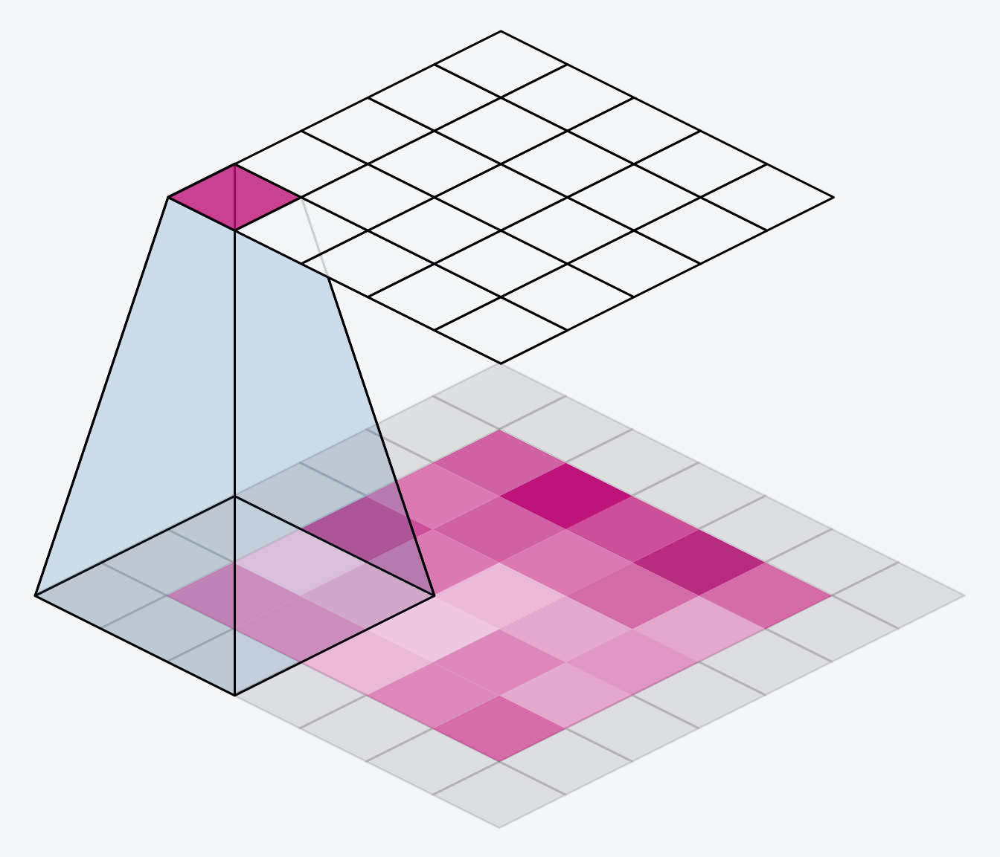
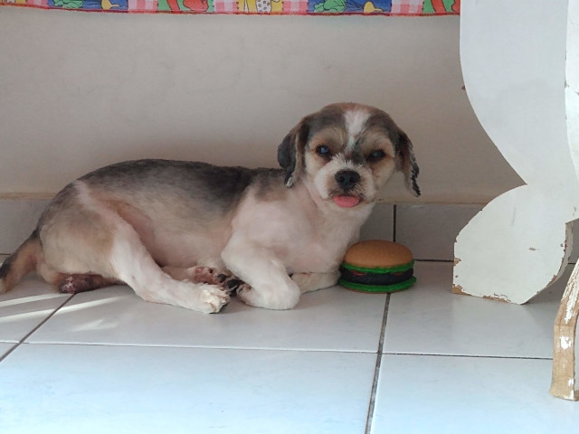
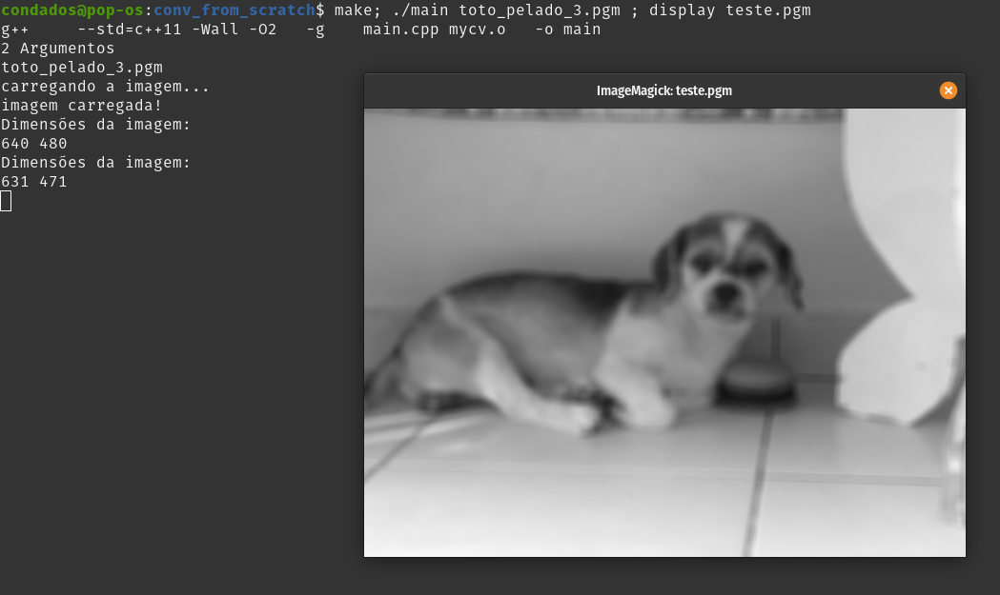

# Implementação da Operação de Convolução em imagens 2D
Projeto bem simples, só mais para praticar o C++ e ter algum projeto com minha implementação da operação de convolução mais "completinha" (com stride, padding sendo variáveis, além do padrão padding = 0, stride = 1). 

Fiz umas abstração simples de uma classe Imagem, apenas para trabalhar com imagens em tons de cinza (poderia ter feito colorido também, sem grandes dificuldades a mais) e para carregar e salvar imagens da memória eu decidi trabalhar com o padrão PGM ([Documento](https://en.wikipedia.org/wiki/Netpbm#File_formats) sobre o projeto **Netpbm** e os formatos de imagens definidos por eles.) que é o mais simples para implementar, embora ocupe muito espaço de memoria.

A função que implementa a convolução **conv2D** recebe como parâmetros:
- Uma Imagem
- kernel/máscara(prefiro o termo kernel): um vetor de float
- f: indicando a dimensão do kernel
- s: stride, "saltos que o kernel dará durante a convolução" o padrão é 1
- p: padding, quanto que a imagem original vai ser expandida antes de operar
- same: boolean que se passado como true a imagem resultante será da mesma dimensão da imagem de entrada, caso seja false (padrão) as dimensões da imagem de saída será:

$width_{out} = floor(\frac{width_{in} + 2*p - f}{s} + 1)$

$height_{out} = floor(\frac{height_{in} + 2*p - f}{s} + 1)$

Utilizei essa imagem como entrada e apliquei um simples filtro de média de tamanho 10x10 (f = 10)

Feel free para testar! 

Farei uma atualização desse projeto em breve, adicionarei a possibilidade de armazenar o dado em forma de float também, provavelmente farei como o opencv e abstrair um tipo Matrix ao em vez de Imagem para ficar mais genérico, pois já que a operação de convolução pode gerar resultados reais, armazenar apenas em formato uint8 (byte) limita muito as possibilidades de uso da operação.

Trabalhos Futuros:
- Imagens RGB
- Nova estrutura para trabalhar tanto com imagem quanto com matriz de valores reais (provávelmente abstrair tudo para uma coisa só)
- Implementar MaxPool and AvgPool
- Convolução em imagens de múltiplos canais
- Colocar mais exemplos aqui e explicar melhor os conceitos por trás (fiz esse projetinho só pra praticar, nem tava pensando em postar, mas talvez seja útil no futuro)
