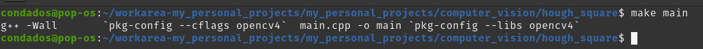
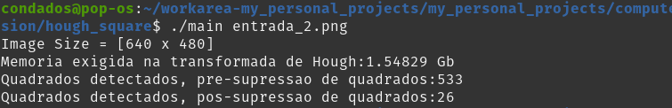
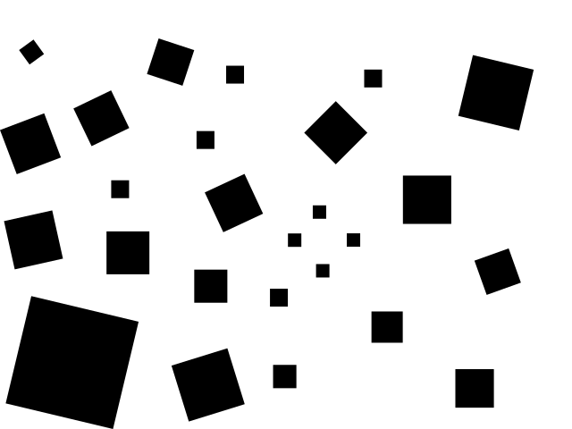
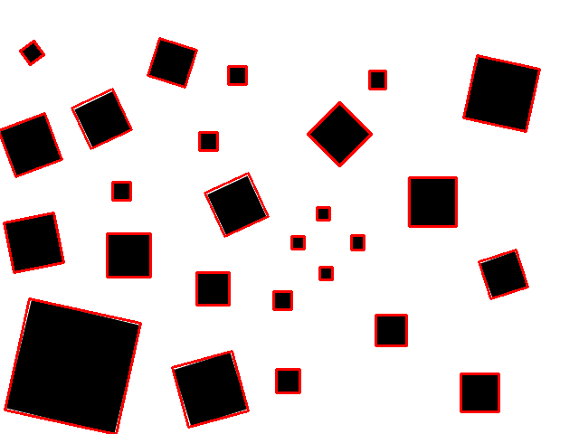
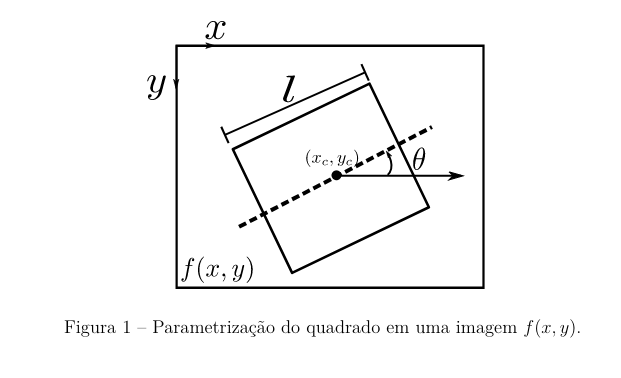
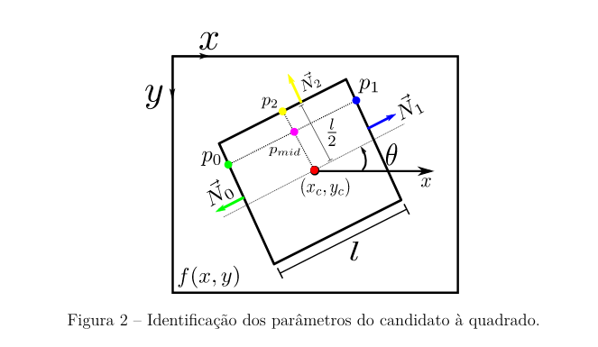
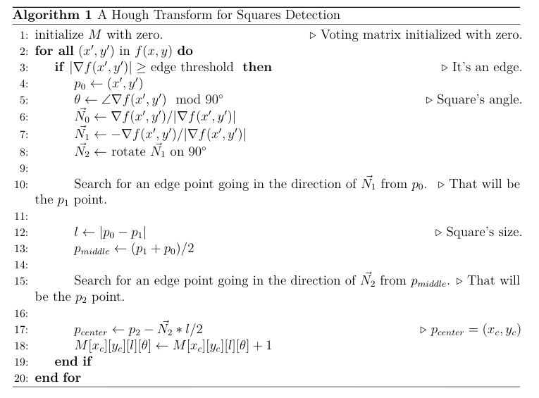
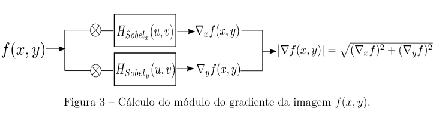
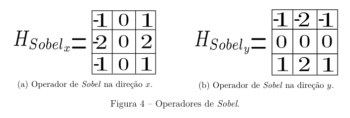

# Transformada de Hough para Identificação de Quadrados
O programa recebe como entrada uma imagem que deve conter quadrados pretos em um fundo branco, o programa tenta identificar os parâmetros de todos os quadrados presentes na imagem, para confirmar isso ele desenha em cima da imagem de saída quadrados vermelhos que foram reconhecidos.

# Pré-requisitos
Fora o compilador, você vai precisar usar o opencv na versão 4x.

# Compilando

Para compilar basta executar o make,

# Executando

A imagem de entrada:

Resultado da identificação

# Explicando o Funcionamento do Programa

## Breve Explicação Sobre o Projeto

A transformada de _Hough_ é um método comum para detecção de formas que são facilmente parametrizáveis (formas comuns: linhas e círculos). Geralmente essa transformada é utilizada após a etapa de pré-processamento da imagem, principalmente após detecção de bordas.

O método consiste em mapear determinados pixeis da imagem numa determinada célula no espaço de parâmetros que definem a figura geométrica. Esse procedimento é repetido para toda a imagem e as células do espaço de parâmetros são incrementadas, servindo assim de indicadores da existência de uma determinada forma.

Neste trabalho será apresentado uma implementação da transformada _Hough_ para a identificação de quadrados pretos em imagens com fundo branco baseado no gradiente. Para isso foi feito a parametrização de um quadrado com a informação do centro do quadrado, tamanho do lado e orientação com relação ao eixo horizontal ($x_c, y_c, l, \theta$), por isso o espaço de configuração terá dimensão $4$. Para fazer o mapeamento entre o espaço de imagem e o de parâmetros foi utilizado a informação do gradiente da imagem e um ponto de borda, para com isso obter-se as normais do quadrado e com isso estimar os quatro parâmetros. Após o mapeamento/acumulo dos indicadores é feito uma etapa de filtragem dos quadrados, para melhorar a precisão da detecção.

## Explicação Mais Detalhada

Como já mencionado, o objetivo deste trabalho foi apresentar e testar uma abordagem de identificação de quadrados pretos em imagens brancas, fazendo uso da transformada *Hough* e do gradiente da imagem. A  parametrização dos quadrados utilizada foi: centroide $(x_c,y_c)$; orientação com relação ao eixo horizontal ($\theta$) e o comprimento de seu lado ($l$) em pixeis (a Figura 1 ilustra essa parametrização).

Na Figura 1 podemos ver uma ilustração de um quadrado (não preenchido) em uma imagem, referenciada por $f(x,y)$, com os parâmetros que o definem sendo destacados. Também é importante notar nessa imagem que o sistema de coordenadas utilizado é localizado no canto superior esquerdo da imagem e sua orientação também é como o ilustrado.\\

A Figura 2 apresenta pontos e vetores chaves para o mapeamento em espaço de parâmetros, as notações presentes nessa figura será utilizado nas descrições a seguir.\\

A primeira etapa do algoritmo proposto é calcular o gradiente $\nabla{f(x,y)}$ da imagem de entrada $f(x,y)$. O módulo dele $|\nabla{f(x,y)}|$ será utilizado para indicar quais pixeis fazem parte de alguma borda, para isso foi definido um limiar que se ultrapassado sinalizará que o mesmo pertence a uma borda. O limiar utilizado neste trabalho foi escolhido empiricamente, o valor utilizado em todos os experimentos foi de $200$, porém vale salientar que devido a imagem de entrada possuir apenas pixeis $100\%$ pretos ou $100\%$ brancos e a uma etapa final de filtragem de quadrados no método proposto (que será explicado mais adiante), o limiar possuí uma ampla faixa de valores que permitem o bom funcionamento do algoritmo.\\

A proposta consiste em visitar cada pixel em $f(x,y)$ e analisar o módulo do gradiente nesse ponto, caso seja classificado como borda, usa-se a informação do gradiente, que corresponde ao vetor normal do lado ao qual esse pixel pertence (desconsiderando os erros de quantização devido à natureza digital da imagem), utilizando a informação do gradiente nesse ponto é estimado a orientação do quadrado fazendo $\Vec{N_0} \mod{90^\circ}$ (isso é possível devido à simetria de um quadrado). Note que é possível também, estimar as demais normais do quadrado a partir de $\Vec{N_0}$, também fazendo-se uso da simetria da figura. As demais normais servirão para facilitar a compreensão em qual sentido deve-se buscar os demais pontos. A partir de um ponto $p_0$ de borda identificado, percorre-se no sentido de $-\Vec{N_0}$ (ou $\Vec{N_1}$)(ver Figura \ref{fig:ilustracao_quadrado_parametrizado}) até encontrar um segundo ponto de borda $p_1$. A distância entre ambos os pontos indicara o comprimento $l$ do lado do quadrado. \\

A próxima etapa é caminhar em uma direção ortogonal ao vetor $\overrightarrow{p_0p_1}$ (uma maneira de obter esse vetor é rotacionar $N_0$ em $90^\circ$, como foi feito neste trabalho) até encontrar um terceiro ponto de borda $p_2$. Com $p_2$ e a estimativa do tamanho $l$, estima-se o centro do quadrado fazendo: $(x_c, y_c) = p_2 - \Vec{N_2}\frac{l}{2}$, sendo $\Vec{N_2}$ o vetor normal no ponto $p_2$. Com esse procedimento é feito o mapeamento do domínio da imagem para o de parâmetros de um quadrado: $(x,y) \Rightarrow{} (x_c,y_c,l,\theta)$ e é realizado um voto na matriz de votação ($M[x_c][y_c][l][\theta] = M[x_c][y_c][l][\theta] + 1$).

A seguir é apresentado um pseudo código ilustrando o procedimento de mapeamento $(x,y) \Rightarrow{} (x_c,y_c,l,\theta)$.

Uma vez que tenha-se percorrido por completo o domínio de $f(x,y)$, faz-se a seleção de quais conjuntos de parâmetros na matriz $M$ pode ser considerado um quadrado, para isso é definido outro limiar, esse por sua vez indica a partir de quantos votos um dado candidato a quadrado pode ser considerado de fato um quadrado presente na imagem de entrada. No presente trabalho esse limiar foi usado como sendo igual a $4$.\\

É realizado uma etapa final de filtragem/supressão na lista de quadrados identificados, objetivando melhorar a identificação e para tornar o algoritmo menos sensível à escolha do limiar de votos mínimos. Percorre-se a lista que contém todos os supostos quadrados, que foram classificados como tal devido ao processo de contagem da contagem dos votos, e busca-se grupos destes que apresentem superposições ou interseções entre si, ao ser identificado essas situações é criado um quadrado representante a partir da media dos parâmetros dos candidato à quadrado que se encontram em superposição. Ou seja, é calculado o quadrado médio em caso de superposição de quadrados. A identificação da superposição é feita analisando a distancia entre os centros dos quadrados, caso essa distância seja menor que a soma da metade das diagonais dos quadrados, será considerado uma superposição e faz-se a média.

A Figura ?? ilustra o procedimento para o cálculo do módulo do gradiente da imagem. Obtém-se inicialmente as componentes do gradiente nas direções $x$ e $y$, por meio da convolução de $f(x,y)$ com os operadores de **Sobel** e por fim calcula-se o módulo.

Foi utilizado a convolução entre a imagem ($f(x,y)$) com os operadores de **Sobel** para obter-se o gradiente da imagem. A Figura ?? apresenta esses operadores. Aqui também é importante notar que ambos os operadores ?? e ?? estão de acordo com o sistema de coordenadas adotadas, ou seja, eixo $x$ crescente para a direita e $y$ crescente para baixo, considerando o referencial limite superior esquerdo da imagem, como já mencionado.\\

Visando a validação do trabalho foi feita uma implementação (em **C++** e fez-se uso da biblioteca de visão computacional **OpenCV** do procedimento proposto. Aplicando diferentes imagens com fundo branco e com um número conhecido de quadrados pretos, como entrada e gerando como saída uma imagem contendo os quadrados identificados em vermelho superpondo a imagem de entrada. Dessa forma é fácil analisar visualmente se todos os quadrados foram identificados corretamente, além disso o programa exibe uma saída no terminal com a contagem do número de quadrados identificados antes e depois da etapa de filtragem. Algumas imagens extras são geradas também, como a de gradiente e uma imagem contendo os quadrados identificados na etapa pré filtragem, apenas para fins comparativos.

O programa contém alguns parâmetros além dos já mencionados (quantidade de votos mínimos e limiar para classificação da borda) que podem ser ajustáveis diretamente no código, tais parâmetros servem para controlar o quanto de memoria pode será utilizado, pois por se tratar de uma matriz de parâmetros quadridimensional, mesmo usando-se de palavras pequenas (foi utilizado variáveis de 16bits de tamanho para ser os acumuladores) facilmente o programa exigirá grandes quantidades de memoria. Por exemplo:

Para imagens de 640 x 480 pixeis e com os lados dos quadrados variando de 2 até 480 pixeis e realizando uma discretização dos ângulos de 0 à 90 com 90 pontos igualmente espaçados. Usando-se palavras de 16 bits (2 bytes), a memoria necessária para alocar a matriz de parâmetros será de aproximadamente: 

$$
    memory\_needed = 640 * 480 * (480 - 2) * 90 * 2 * 10^{-9} \approx 26.43 Gb
$$

Os parâmetros extras são: tamanho mínimo e máximo de lado de quadrados que serão identificados e a discretização do ângulo. A discretização do ângulo foi usada, na maioria dos experimentos, igual à $90/5 = 18$. O que se traduz para uma precisão de $5^\circ$ graus. Já o tamanho dos lados dos quadrados foi para a maioria dos experimentos: $l_{min} = 5$ e $l_{max} = 100$ px.