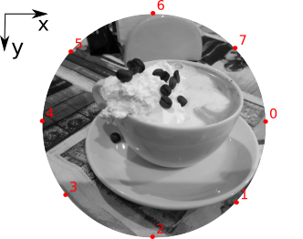
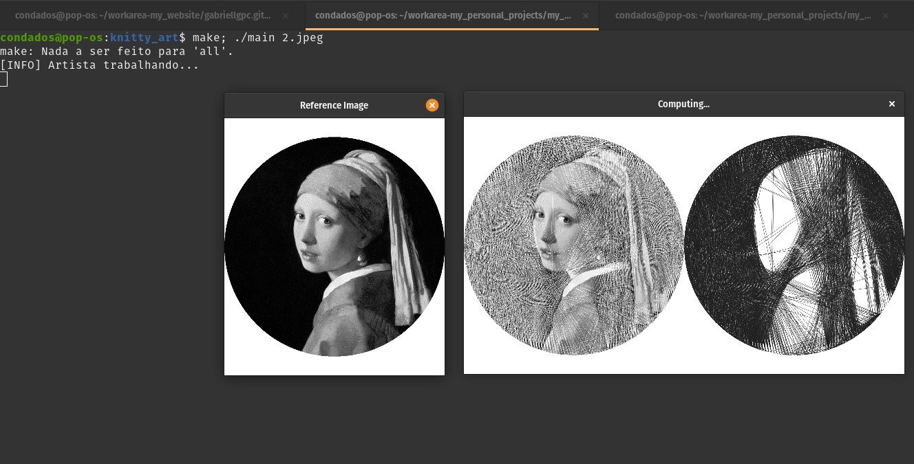
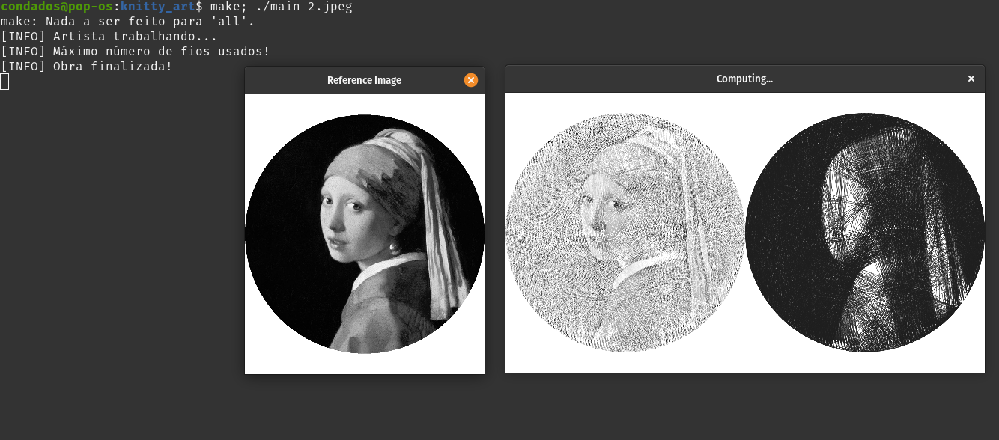

# Arte Com Fios
Este projeto se trata da minha implementação para reproduzir o trabalho de arte com fios [Art Nitka](https://www.instagram.com/art.nitka/?utm_source=ig_embed). O programa recebe uma imagem e gera, através de um processo por busca exaustiva, uma imagem feita apenas com linhas pretas em um fundo branco que tenta reproduzir a imagem original. A seguir podemos ver uma animação do processo ocorrendo em etapas.


É possível encontrar no Github alguns projetos que fazem isso também, porém não vou utilizar nenhum código como base, mas a ideia geral eu tirei desse [video](https://www.youtube.com/watch?v=YZtx4jNNbx8&ab_channel=UniversoProgramado) (excelente vídeo por sinal). A ideia base é até bem simples e atualmente só gera imagens com fundo branco e fios pretos, ao final vou deixar umas ideias de como eu penso em fazer com "fios coloridos".

Visão Geral do Algoritmo:
- Converte a imagem para escala de cinza (também faço um resize para deixar sempre com uma largura especifica, mas não é obrigatório);
- Aplico uma máscara circular no centro da imagem, será a "imagem de referência" para o programa;
- Calcula a posição dos "pinos"/pinos ao longo da circunferência desse círculo, os pinos são distribuídos de forma uniforme (defasados 360/número_de_pinos um do outro). O número de pinos é ajustável;
- Processo iterativo:
  - Testa combinações de pares de pinos (start_pin, end_pin) e atribuí uma pontuação para cada reta correspondente a esses pares de pontos (quanto mais pixels escuros a linha passa maior essa pontuação, score = 255 - px)
  - Seleciona a reta/linha com maior pontuação (par: start_pin, end_pin)
  - Salva o par (start, end) em uma lista para devolver no final; Desenha a reta na imagem de saída
  - Apaga essa linha na imagem de referência (percorre a reta correspondente à start_pin, end_pin e aumenta o valor dos pixels que fazem parte da reta em um valor que é ajustável)
  - Repete o procedimento até usar todas as linhas (número máximo de linhas pré-determinado) ou se atingir um número máximo de iterações
- Ao final retorna a imagem resultante 
- A lista da sequência de movimentos (pino de saída, pino de chegada) que foram utilizadas no processo (isso é útil para a reprodução da arte fisicamente).

A seguir eu mostro uma imagem de como fica a ordem dos pinos no círculo,



Compilando e executando (no modo debug para ver as iterações):





<!--  -->

Já fiz alguns testes usando **"fios coloridos"** e o mais promissor foi:
- Primeiramente separar a imagem colorida em imagens contendo apenas uma cor especifica, eu testei usar k-means para formar N grupos de cores representativas da imagem (N de 3 à 5 geralmente já estava bom);
- Separar N imagens em escala de cinzas da imagem original, cada uma representando apenas um dos grupos de cores;
- Utilizar o algoritmo que tinha usado para imagens em escala de cinza e no final eu junto tudo criando uma única imagem (dessa forma também facilita bastante a paralelização do algoritmo, uma thread para cada uma dessas N imagens).

O mais complicado (e por isso ainda não postarei ainda) é a etapa de junção dos resultados, eu reparei no trabalho "real"/físico que o artista faz as artes coloridas por camadas de cores, por exemplo, ele primeiro traça todos os fios azuis e isso será a primeira camada, em seguida faz apenas com outro cor e assim por diante, até aí tranquilo, o problema é decidir automaticamente qual a ordem das camadas, ou seja, a ordem com que será desenhado cada um dos resultados individuais (é nessa etapa também que troco os "fios pretos" pelos coloridos correspondentes).


**Obs.:** Gerei o gif animado usando o [imagemagick](https://webinista.com/updates/how-to-create-animated-gifs-imagemagick/)

```
$ convert -delay 100 -loop 5 -dispose previous gifs/*.png animation.gif
```

